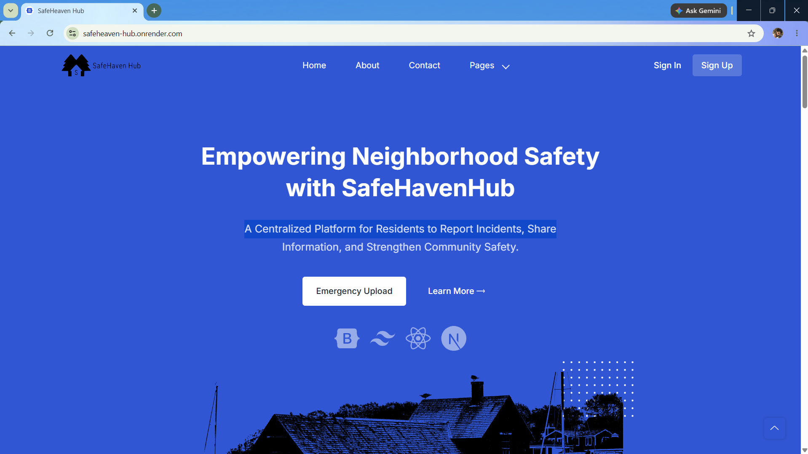
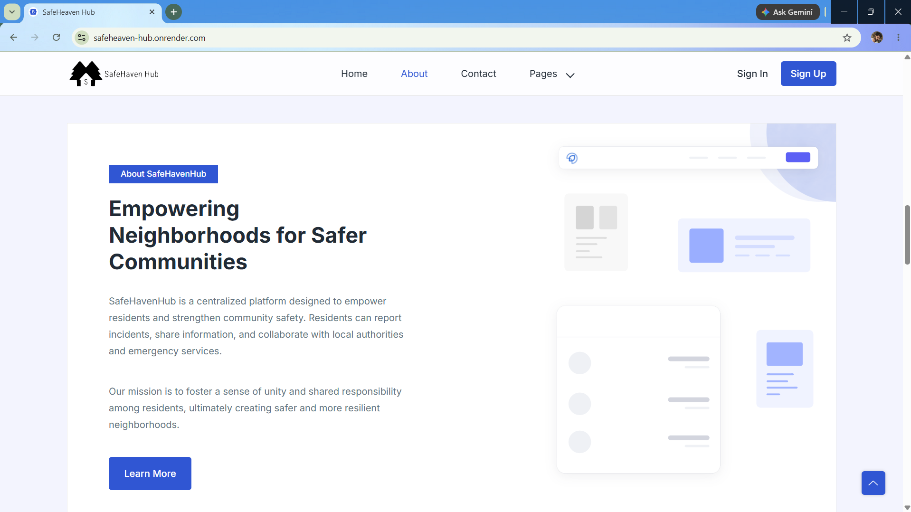
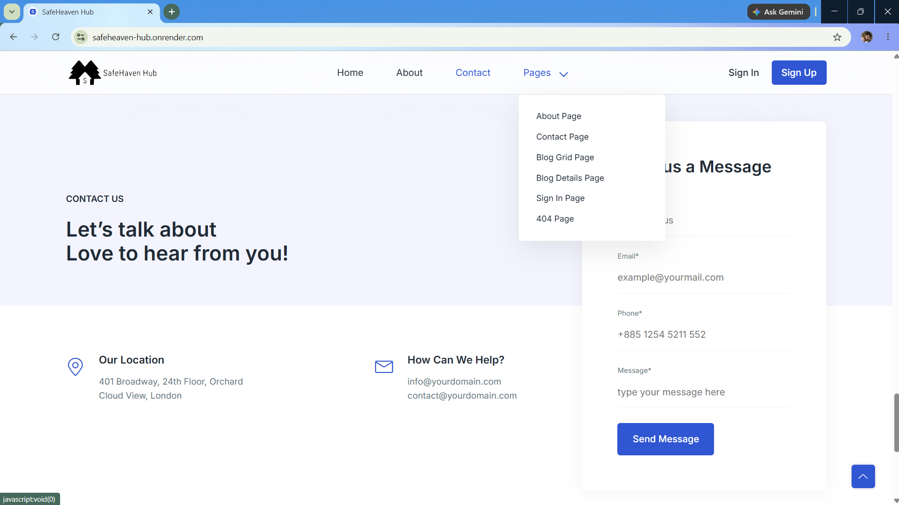
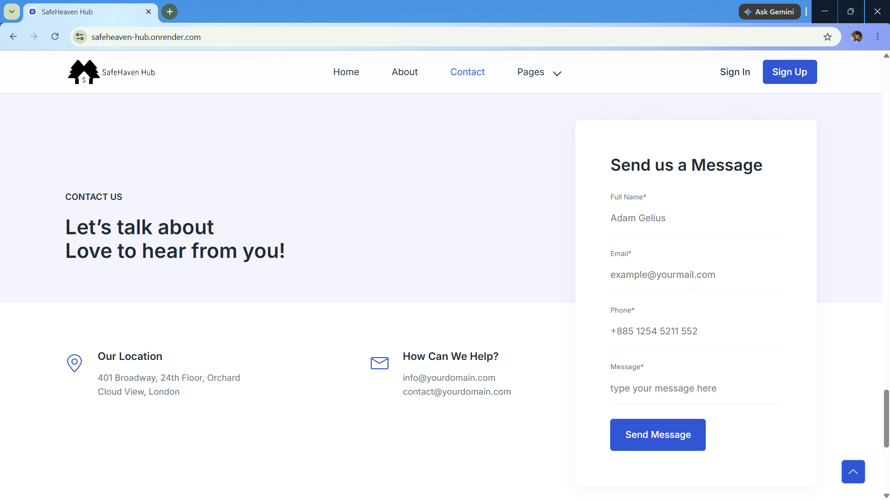

# 🛡️ SafeHeaven-Hub

<p align="center">
  <h3 align="center">A Modern Neighborhood Safety Web Application</h3>
  <p align="center">
    Report incidents, stay informed with community safety alerts, and promote neighborhood awareness through a secure and responsive platform.
  </p>
</p>

<p align="center">


</p>

---

# 🌐 Live Demo

### 🚀 https://safeheaven-hub.onrender.com/

---

# 📖 About

SafeHeaven-Hub is a full-stack Neighborhood Safety Web Application designed to improve community awareness by allowing residents to report incidents, stay informed about safety alerts, and access important neighborhood updates.

The platform provides a clean, responsive, and user-friendly interface that encourages active community participation while helping create a safer living environment through real-time information sharing.

---

# ✨ Features

✅ Community Incident Reporting

✅ Neighborhood Safety Awareness

✅ Real-Time Community Updates

✅ Secure User Authentication

✅ Responsive User Interface

✅ Contact & Support Page

✅ Informative Community Pages

✅ Fast Performance

✅ Mobile Friendly Design

✅ Clean & Modern UI

---

# 🛠 Tech Stack

| Technology | Usage |
|------------|-------|
| React.js | Frontend Development |
| Node.js | Backend Runtime |
| Express.js | Backend Framework |
| MongoDB | Database |
| JavaScript | Programming Language |
| HTML5 | Structure |
| CSS3 | Styling |

---

# 📸 Application Preview

<table align="center">

<tr>

<td align="center">

### 🏠 Home



</td>

<td align="center">

### ℹ️ About



</td>

</tr>

<tr>

<td align="center">

### 📄 Pages



</td>

<td align="center">

### 📞 Contact



</td>

</tr>

<tr>

<td colspan="2" align="center">

### 🔐 Sign In


</td>

</tr>

</table>

---

# 📂 Project Structure

```text
SafeHeaven-Hub
│
├── images/
│   ├── home.png
│   ├── about.png
│   ├── pages.png
│   ├── contact.png
│   └── sign in.png
│
├── public/
├── src/
│   ├── assets/
│   ├── components/
│   ├── pages/
│   ├── services/
│   ├── App.jsx
│   └── main.jsx
│
├── package.json
├── package-lock.json
├── vite.config.js
└── README.md
```

---

# 🚀 Getting Started

## Clone Repository

```bash
git clone https://github.com/abhay7532/SafeHeaven-Hub.git
```

---

## Navigate to Project

```bash
cd SafeHeaven-Hub
```

---

## Install Dependencies

```bash
npm install
```

---

## Run Development Server

```bash
npm run dev
```

---

Open your browser

```
http://localhost:5173
```

---

# 🎯 Use Cases

- Report neighborhood incidents

- Increase community awareness

- Stay updated with local safety information

- Encourage community participation

- Provide a centralized platform for neighborhood communication

---

# 💡 Future Enhancements

- 📍 Live Incident Map

- 🚨 Emergency Alert System

- 🔔 Push Notifications

- 📊 Community Safety Analytics

- 📱 Progressive Web App (PWA)

- 👥 Resident Discussion Forum

- 🤖 AI-Based Incident Classification

- 📧 Email & SMS Notifications

---

# 🤝 Contributing

Contributions are welcome!

1. Fork this repository

2. Create your branch

```bash
git checkout -b feature-name
```

3. Commit changes

```bash
git commit -m "Added new feature"
```

4. Push your branch

```bash
git push origin feature-name
```

5. Open a Pull Request

---

# 👨‍💻 Developer

## Abhay Verma

🎓 Computer Science & Engineering Student

💻 Full Stack Developer | Cybersecurity Enthusiast

### GitHub

https://github.com/abhay7532

### LinkedIn

https://www.linkedin.com/in/linkwthabhay/

---

# ⭐ Show Your Support

If you found this project useful,

⭐ Star this repository

🍴 Fork it

📢 Share it

---

<p align="center">

Made with ❤️ by <b>Abhay Verma</b>

</p>
